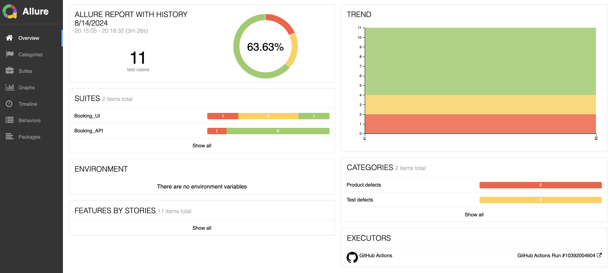
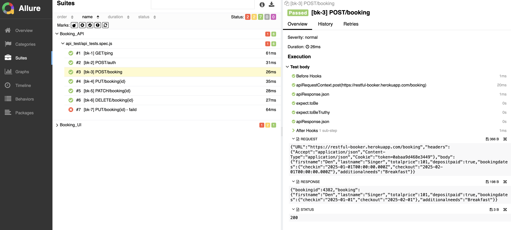
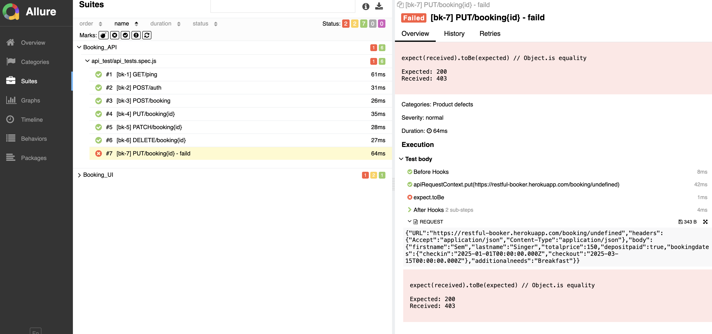
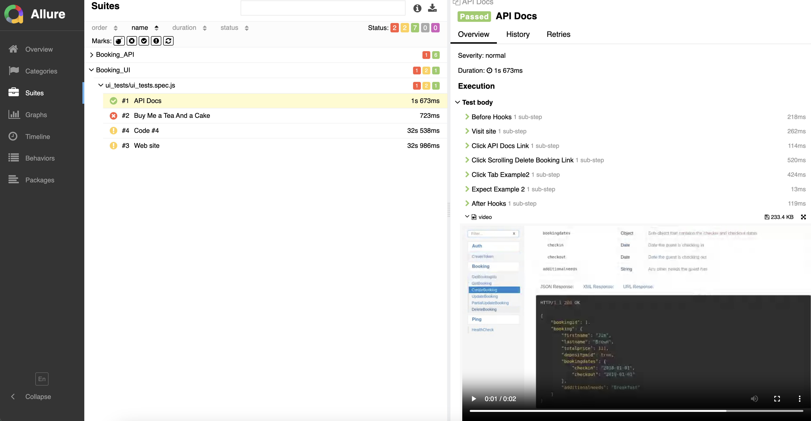
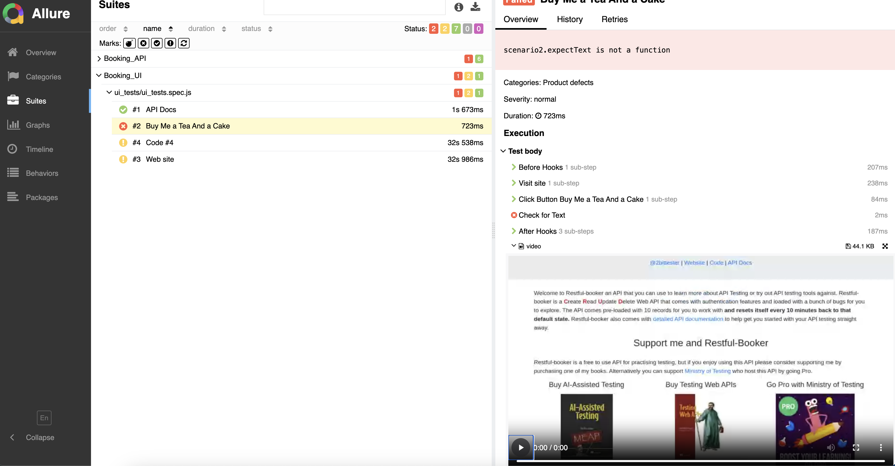

# js-playwright-allure

This project provides the ability to integrate Playwright collections into the Continuous Integration (CI) process, allowing API and UI tests to be run automatically. The results of test execution are processed and presented as a detailed Allure report, which contains full information about each test, including its steps, parameters, answers and possible errors, as well as a video of the UI test process. This provides visibility and convenience when analyzing test results, allowing you to quickly identify and fix problems.
 
## Сontent
- [Technology](#Technology)
- [Requirements](#Requirements)
- [Installation](#Installation)
- [Execution](#Execution)
- [Report](#Report)
- [License](#License)

## Technology
- [Playwright](https://playwright.dev/)
- [Allure](https://allurereport.org/)

## Requirements
To install and run the project, you need [NodeJS](https://nodejs.org/), [Java](https://www.java.com/) version 8 or above.

## Installation

1. Установите Allure-Report

2. Install the npm package using the command:
```sh
npm install
npx playwright install
```

## Execution

1. Save your test scripts to the `tests/api_test` and/or `tests/ui_tests` folder

2. To execute the API tests, run the command:
```sh
npx playwright test api_test/api_tests.spec.js --project=Booking_API --reporter=line,allure-playwright
```
- `api_test/api_tests.spec.js` => API tests file in `tests` folder
- `--project=Booking_API` => project with presets
- `--reporter=line,allure-playwright` => Reporter Name 
- The files for the report will be generated, based on the results of the collection in the `allure-results` folder.

To execute the UI tests, run the command:
```sh
npx playwright test ui_tests/ui_tests.spec.js --project=Booking_UI --reporter=line,allure-playwright
```
- `ui_tests/ui_tests.spec.js` => UI tests file in the `tests` folder
- `--project=Booking_UI` => project with presets
- `--reporter=line,allure-playwright` => Reporter Name 
- The files for the report will be generated, based on the results of the collection in the `allure-results` folder.

4. Execute the command to generate a report to the `allure-report` folder:
```sh
allure generate
```
5. Execute the command to open the report in a browser:
```sh
allure serve
```

## Report

### Main page

### API report


### UI report



## License
This project is licensed under the MIT License - see the [LICENSE](LICENSE) file for details
